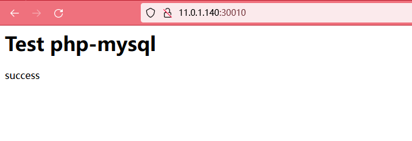

# LNMP in Kubernetes

> Change config file and then apply all yaml file

## Pull

```bash
git clone https://github.com/Paper-Dragon/lnmp-in-k8s.git
```

## Config

```
root@k8s-master:~/k8s-lnmp# grep -n server: *
nginx.yaml:31:         server: 11.0.1.140  #YOUR-NFS-SERVER-IP-ADDRESS 
php.yaml:30:         server: 11.0.1.140 # YOUR-NFS-SERVER-IP-ADDRESS 


If U don't know your nfs server ip address.
Run follow command check your nfs server.
Then get this server's ip address.
# exportfs -rv
---
root@k8s-master:~/k8s-lnmp# exportfs -rv
exporting *:/nfs
---
```

## Run

```bash
kubectl apply -f lnmp-in-k8s/*
```

## Check

```bash
root@k8s-master:~/k8s-lnmp# kubectl get deployments.apps
NAME    READY   UP-TO-DATE   AVAILABLE   AGE
mysql   1/1     1            1           109m
nginx   1/1     1            1           113m
php     1/1     1            1           121m
root@k8s-master:~/k8s-lnmp# kubectl get svc
NAME         TYPE        CLUSTER-IP       EXTERNAL-IP   PORT(S)        AGE
kubernetes   ClusterIP   10.96.0.1        <none>        443/TCP        16d
mysql-svc    ClusterIP   10.110.251.247   <none>        3306/TCP       109m
nginx-svc    NodePort    10.99.28.223     <none>        80:30010/TCP   113m
php-svc      ClusterIP   10.99.217.170    <none>        9000/TCP       117m
root@k8s-master:~/k8s-lnmp# kubectl get po
NAME                     READY   STATUS    RESTARTS   AGE
mysql-5dbb99785b-9wqck   1/1     Running   0          111m
nginx-576c74f5d6-bqmss   1/1     Running   0          115m
php-5c96b64f8c-28g29     1/1     Running   0          24m
```


